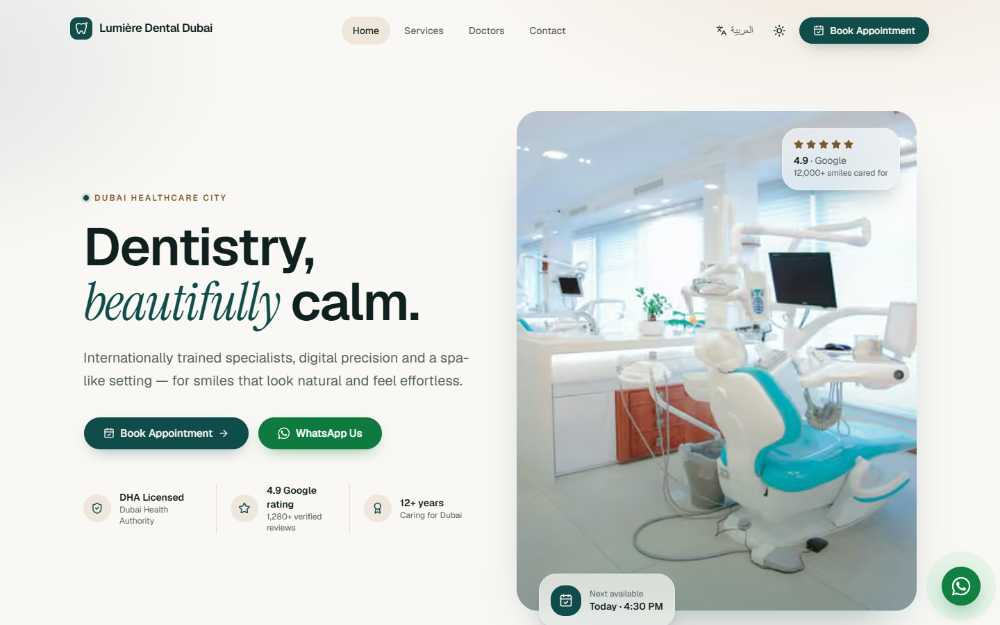
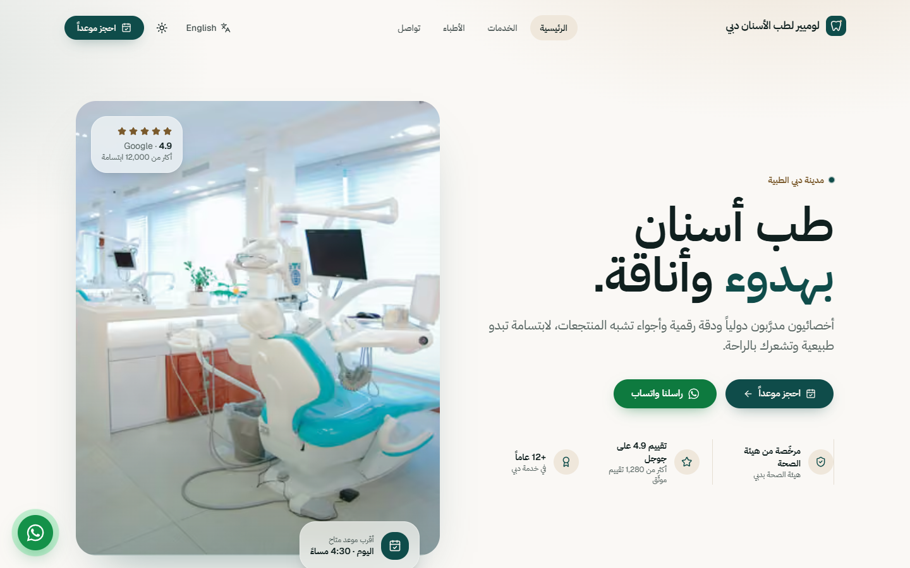
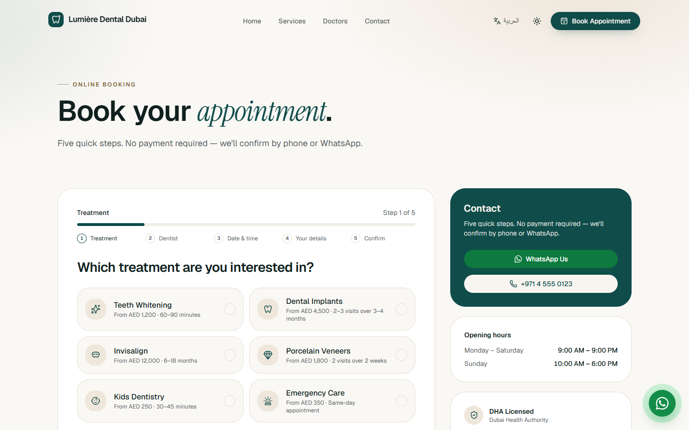

# Lumière Dental Dubai

A bilingual (English / Arabic) website for a premium dental clinic in Dubai Healthcare City. Calm, luxury design, full right-to-left support, online booking in five steps, and production-grade SEO, accessibility and performance.

**Live demo:** _coming soon_

> Demo project by Ahmad Khajeh — [ahmadkhajeh.com](https://ahmadkhajeh.com). The clinic, doctors, reviews and prices are fictional. Photos are from [Unsplash](https://unsplash.com).

## Screenshots







## Highlights

- **Truly bilingual.** Every page is available in English and Arabic, with mirrored right-to-left layouts, Arabic typography, localized dates and times, and a language switcher that keeps you on the same page.
- **Online booking in five steps.** Choose a treatment, a doctor who performs it, a date and time within real opening hours, enter your details, then review and confirm. Every step is validated, keyboard friendly and screen-reader aware, and ends with an animated confirmation and booking reference.
- **Secure forms.** Booking and contact requests are validated on the server, protected against spam bots, and delivered to the clinic by email.
- **Rich home page.** Hero with trust badges, treatments grid, an interactive before/after slider, doctors carousel, patient stories, insurance partners, FAQ, and a map with opening hours.
- **Treatment and team pages.** Each treatment has its own page with pricing, duration, steps and FAQs, and a dedicated page introduces the specialist team.
- **Built for search.** Per-page metadata, language alternates, rich structured data for the clinic, services and FAQs, social share images in both languages, and a multilingual sitemap.
- **Fast by design.** Every page is pre-rendered. Animations use lightweight CSS, heavier features load only when needed, and the Arabic font is self-hosted and optimized.
- **Accessible.** Semantic structure, skip link, visible focus states, labelled controls, accessible error messages, AA colour contrast and reduced-motion support.
- **Dark mode,** an animated mobile menu, and a floating WhatsApp button on every page.

## Tech stack

| Area | Technology |
| --- | --- |
| Framework | Next.js 16 (App Router), React 19, TypeScript |
| Styling | Tailwind CSS v4, shadcn/ui (Radix) |
| Internationalization | next-intl (English and Arabic, RTL) |
| Animation | Motion, CSS scroll-driven animations |
| Forms | React Hook Form, Zod, React Day Picker, Server Actions |
| Email | Resend |
| Hosting | Vercel |

## Run locally

```bash
npm install
npm run dev
```

Then open [http://localhost:3000](http://localhost:3000).
